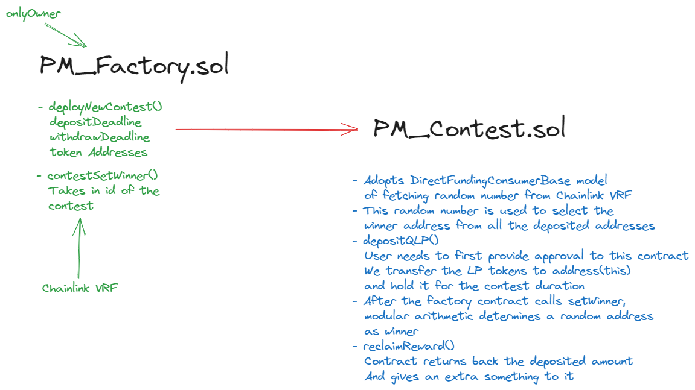

# Pool-Maxi V1 (No-Loss Lottery Protocol with Higher Yields)
 

 

## Lottery Game with No Loss Criteria - A Financially Significant Opportunity

This repository introduces a Pool Together inspired lottery game that offers participants a unique and financially significant opportunity. Unlike traditional lotteries, our protocol ensures that every participant experiences no  financial loss. This innovative concept opens up exciting possibilities for users to engage in a lottery-like experience while preserving their initial investment.

Yield source being based on the high-APR proven sources like the LP tokens of GMX, QuickPerps, etc.
it's way way better than the rewards PoolTogether provides.
The objective is to create a "no-loss-lottery" environment where participants can deposit their LP tokens and earn rewards collectively.

### How it works
1. Deposits : Users call the `depositQLP` function of the ongoing contest. They initially have to give approval to this smart contract of the LP tokens being dealt with.
2. Reward Collection : After the `depositDeadline` gets passed, the protocol calls `handleRewards` function of the `RewardRouter` contract and receives the collective amount of trading fees being allocated to the amount of LP tokens the Contest contract holds.
3. Winner Selection : `DirectFundingConsumer` model of fetching random number from `Chainlink VRF` is used to generate onchain randomness. This randomness is used to select the winner and set the `winnerAddress`
4. User Token Return : After the `withdrawDeadline` has passed, each user can then call `reclaimReward()` function and gets back whatever amount he had deposited. More better, if this user is the randomly chosen winner, he gets transferred all the trading fees reward as his fucking prize.

### Structurized Components
1. Factory Contracts : The Factory contracts are responsible for deploying multiple instances of Contest contracts. Each Contest contract represents a unique lottery game session.

2. Contest Contracts : The Contest contracts handle the execution and management of individual lottery game sessions. Once a session is completed, a new Contest contract is deployed by the Factory contract to continue the lottery experience seamlessly.

Until next time, [@proxima424](https://twitter.com/proxima424)

## TODO

-> Inside src folder, make new folders namely Mainnet, Arbitrum, Avalanche, zkevmPolygon
-> Inside mainnet : Form these folders -> swellNetwork
-> Inside arbitrum : Form these folders -> GLP
-> Inside zkevmPolygon : Form these folders -> QLP

-> In Contest.sol, remove all hardcoded addresses and take them as params in constructor
-> Remove QLP from all function name. We need to integrate all sorts of yield sources not just QLP.
   After the contract is generalized, copy paste them in Mainnet, Arbitrum and Avalanche folders.
-> For polygon zkevm we need another random number source mp API3 smth. Integrate API3 ( I'll help in this )

